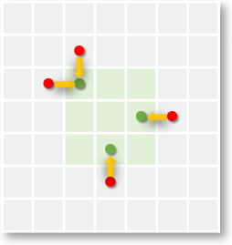

# Linq2d
Linq2d is a C# library designed to provide a convenient way to express various arithmetic filters over 2d arrays with a decent performance.
It relies upon the Linq concepts for writing the array transforms and dynamic code generation for performing the actual computation.
I have created it mostly for fun, out of joy of being able to work with the Lambdas, Expressions, MSIL, and Intel Intrinsics. C# is an awesome language, .Net Core is an awesome platform, and I wanted to probe the boundaries of possible with this. 
## Video
You can watch the presentation of the Linq2d I've made for https://2020.DotFest.ru:
|Russian|English|
|--|--|
|[](https://www.youtube.com/watch?v=IidqxJ2Mb0s)|[](https://www.youtube.com/watch?v=r1xMhJ8nu5g)|
## Intro
Let's do a simple array transform:
```csharp
var sample = new[,] { { 1, 2 }, { 3, 4 } };
q = from s in sample select s + 1;
Assert.Equal(new[,] { { 2, 3 }, { 4, 5 } }, q.ToArray());
```
So far, the query over a 2d array looks like a standard query over an `IEnumerable<int>` would - we have a range variable `s` that takes the values from the input, and an expression that produces the elements of the output. The `.ToArray()` instance method is used to get the query results in a form of `int[,]`. 

Consider a bit more contrived example: 
```csharp
var left = new[,] { { 1, 2 }, { 3, 4 } };
var right = new[,] { { 4, 3 }, { 2, 1 } };
var q = from l in left 
        from r in right 
        select l + r;
Assert.Equal(new[,] { { 5, 5 }, { 5, 5 } }, q.ToArray());
```
Now we're adding the contents of two arrays to each other. Unlike the traditional Linq, Linq2d does not require any kind of joins - it aligns the inputs to each other, and requires them to be of the same size. Size difference would be reported as an `ArgumentException` at the run time.  

### Relative Access
Having an access only to the "current" values of the processed arrays would be boring and too restrictive. Linq2d range variables can do more than that. Let's compute a simple filter known as "C4" - arithmetic mean of the array element neighbours:
```csharp
var sample = new[,] { { 4, 4, 4}, { 4, 4, 4 } , { 4, 4, 4 }};
var q = from s in sample select (s[-1, 0] + s[1, 0] + s[0, -1] + s[0,1]) / 4; // ouch!
```
Have we tried to write such a code in a traditional imperative way, it would immediately produce an `IndexOutOfBounds` exception. That's would Linq2d do as well. In order to make this query work, we need to specify a strategy for handling the out-of-bounds access attempts. One such strategy is "replace", and we can specify it for accessing the sample array via the `.With()` extension method that accepts the substitution value:
```csharp
var sample = new[,] { { 4, 4, 4 }, { 4, 4, 4 }, { 4, 4, 4 } };
var q = from s in sample.With(initValue: 0)
        select (s[-1, 0] + s[1, 0] + s[0, -1] + s[0, 1]) / 4;
Assert.Equal(new[,] { { 2, 3, 2 }, { 3, 4, 3 }, { 2, 3, 2 } }, q.ToArray());
```
This code does compile and run fine, and automatically takes care of the corner and border cells that require special handling. However, for our particular case this strategy does not work much good - a "dark halo" appears at the borders. The boundary cells average only three neighbours, and the corner cells get only two. As the divisor is always 4, we're getting an undesired result. Linq2d offers a better strategy to handle such cases - called "nearest neighbour". It moves the out-of-bound cell requests to the closest cells that are within the array boundaries:



This strategy is activated via the same `.With()` extension method with the strategy passed as an argument:
```csharp
var sample = new[,] { { 4, 4, 4 }, { 4, 4, 4 }, { 4, 4, 4 } };
var q = from s in sample.With(OutOfBoundsStrategy.NearestNeighbour)
        select (s[-1, 0] + s[1, 0] + s[0, -1] + s[0, 1]) / 4;
Assert.Equal(sample, q.ToArray());
```
This time the number of cells being added for every target cell is the same, and the "general brightness" is preserved.
In both cases above, Linq2d would verify the size of the input array to fit the provided filter kernel at least once. So, in the C4 case, an attempt to calculate the filter over an array smaller than (3 x 3) will fail.
### Multiple Results
Sometimes the same source data is used to create multiple resulting arrays:
```csharp
var left = new [,] { { 1, 2, 3 }, { 4, 5, 6 }, { 7, 8, 9 }};
var right = new [,] { { 9, 8, 7 }, { 6, 5, 4 }, { 3, 2, 1 }};

var sum = from l in left
          from r in right
          select l + r;

var diff = from l in left
           from r in right
           select l - r;

Assert.Equal(new [,] { { 10, 10, 10 }, { 10, 10, 10 }, { 10, 10, 10 }}, sum.ToArray());
Assert.Equal(new [,] { { -8, -6, -4 }, { -2, 0, 2 }, { 4, 6, 8 }}, diff.ToArray());
```

Iterating only once can offer a better performance than repetitive iterations. This can be done by selecting a ValueTuple in the linq2d expression:
```csharp
var left = new [,] { { 1, 2, 3 }, { 4, 5, 6 }, { 7, 8, 9 }};
var right = new [,] { { 9, 8, 7 }, { 6, 5, 4 }, { 3, 2, 1 }};

var both = from l in left
           from r in right
           select ValueTuple.Create(l + r, l - r); 
           // selecting (l + r, l - r) would be even better, but C# up to 7.3 
           // doesn't support the tuple literals in Expression Trees. See also CS8143 and
           // https://github.com/dotnet/roslyn/issues/12897.

var (s, d) = both.ToArrays(); // the number and types of the arrays do match the 
                              // number and types of the select clause members

Assert.Equal(new [,] { { 10, 10, 10 }, { 10, 10, 10 }, { 10, 10, 10 }}, s);
Assert.Equal(new [,] { { -8, -6, -4 }, { -2, 0, 2 }, { 4, 6, 8 }}, d);
```

### Recurrent Calculations
Sometimes it might be useful to access the already calculated parts of the result array. For example, we might want to compute the "sum of all the cell values in the column from the current one (inclusive) to the top":
```csharp
var sample = new[,] { {1, 2, 3}, {4, 5, 6}, {7, 8, 9} };
var q = from s in sample
        from r in Result.SubstBy(0)
        select s + r[-1, 0];
Assert.Equal(new[,] { {1, 2, 3}, {5, 7, 9}, {12, 15, 18} }, q.ToArray();
```
Result range variable is similar to the input reference, but it is a subject to a few extra limitations:
- Only relative access is allowed. It is prohibited to get the "current" result value, since it hasn't been computed yet
- It is required to provide the value for the result access outside of the result array, in an argument to the static `Result.SubstBy()` method.

Multiple results selection can be combined with the recurrent calculation. Here is an expression that produces the integrals of both data and data squared:
```csharp
byte[,] grayImage = ImageHelpers.IO.LoadGrayScale("test.bmp");
var integral = from g in grayImage
               from ri in Result.SubstBy(0)  
               from rq in Result.SubstBy(0)  
               select ValueTuple.Create(
                 ri[-1, 0] + ri[0, -1] - ri[-1, -1] + g,
                 rq[-1, 0] + rq[0, -1] - rq[-1, -1] + g * g);
```

The Result references should be the last in the sources list, and their count must be less than or equal to the count of the select clause members. 
First Result reference refers to the member #1, second - to #2, and so on. I.e. if the result expression does not need the first recurrent result, then it should be ignored:
```csharp
byte[,] grayImage = ImageHelpers.IO.LoadGrayScale("test.bmp");
var secondRecurrent = from g in grayImage
               from _ in Result.SubstBy(0)  
               from r in Result.SubstBy(0)  
               select ValueTuple.Create(
                 g * 2,
                 g + r[-1, 0] + r[0, -1] - r[-1, -1]);
```
Same result could be achieved by swapping the order of the output parameters; then the dummy range variable is not needed:
```csharp
byte[,] grayImage = ImageHelpers.IO.LoadGrayScale("test.bmp");
var secondRecurrent = from g in grayImage
               from r in Result.SubstBy(0)  
               select ValueTuple.Create(
                 g + r[-1, 0] + r[0, -1] - r[-1, -1],
                 g * 2);
```
### Performance
Performance is important in the numeric computations, especially when dealing with substantially large data sets.
Linq2d attempts to alleviate the abstraction penalties incurred with the .Net framework: 
- Usual multidimensional array acesses (_`a[1, 2]`_) are always subject to the range checks; JIT doesn't optimize those checks away even for the straightforward iteration cycles. 
- Calling a delegate with a small body in a tight loop is a terrible idea, performance-wise; the call overhead is ~10 times more than an integer register-memory operation (Intel x64 is assumed)
Therefore Linq2d does not attempt to execute the operation specified in the select statement as Linq2objects does; it compiles the whole iteration block into a dynamic delegate and then applies it to the input data.
Here are some benchmark results measured on my laptop:

``` ini
BenchmarkDotNet=v0.12.1, OS=Windows 10.0.18363.836 (1909/November2018Update/19H2)
Intel Core i7-6600U CPU 2.60GHz (Skylake), 1 CPU, 4 logical and 2 physical cores
.NET Core SDK=3.1.300
  [Host]     : .NET Core 3.1.4 (CoreCLR 4.700.20.20201, CoreFX 4.700.20.22101), X64 RyuJIT
  DefaultJob : .NET Core 3.1.4 (CoreCLR 4.700.20.20201, CoreFX 4.700.20.22101), X64 RyuJIT
```
|                Method |   FileName |      Mean |    Error |    StdDev | Ratio | RatioSD |
|----------------------:|----------- |----------:|---------:|----------:|------:|--------:|
|       NaturalC4 | p00743.bmp | 360.21 ms | 7.840 ms | 22.241 ms |  2.10 |    0.17 |
| UnsafeC4 | p00743.bmp | 171.59 ms | 3.401 ms |  7.023 ms |  1.00 |    0.00 |
|         LinqC4 | p00743.bmp | 117.92 ms | 2.344 ms |  5.045 ms |  0.69 |    0.04 |
|   LinqC4Cached | p00743.bmp | 102.12 ms | 1.685 ms |  2.768 ms |  **0.60** |    0.03 |
|                       |            |           |          |           |       |         |
|       NaturalC4 | p02652.bmp | 230.55 ms | 4.586 ms |  4.504 ms |  2.08 |    0.06 |
| UnsafeC4 | p02652.bmp | 111.09 ms | 2.116 ms |  1.979 ms |  1.00 |    0.00 |
|         LinqC4 | p02652.bmp |  91.01 ms | 1.812 ms |  4.547 ms |  0.81 |    0.05 |
|   LinqC4Cached | p02652.bmp |  76.23 ms | 1.495 ms |  2.237 ms |  **0.69** |    0.03 |

The C4 filter has been executed over the grayscale bitmaps, one is `5 184 * 6 433` px, the other is `5 184 * 4 157` px. The bitmaps are converted into the `byte[,]` arrays; the filter outputs the `int[,]` array - remember that all arithmetics in C# is either `int` or `long`; there are no `+` or `/` operators defined for bytes. 
The methods compared are as follows:
- **NaturalC4**: a naive iteration with two nested cycles, fair access to the data array with the indexing operatior [,]. Illustrates the penalties for the range checks inserted by .Net to the idiomatic code, likely to be written by a novice developer.
- **UnsafeC4**: baseline method for measuring the performance; uses the fixed pointers to the array data for both input and result to avoid the range checks. Might be written by a seasoned developer who is familiar with the unsafe features of C#.
- **LinqC4**: a fair Linq2d query execution. Incurs the penalties for the dynamic compilation upon every call
- **LinqC4Cached**: prepares the Transform delegate built by Linq2d in advance, and reuses it on every iteration. Illustrates the significance of the dynamic compilation penalties.
The bottom line is that for this type of filter direct linq2d wins 20% to 30% of the execution time against the "manually optimized" code; caching wins ~10% more. 

